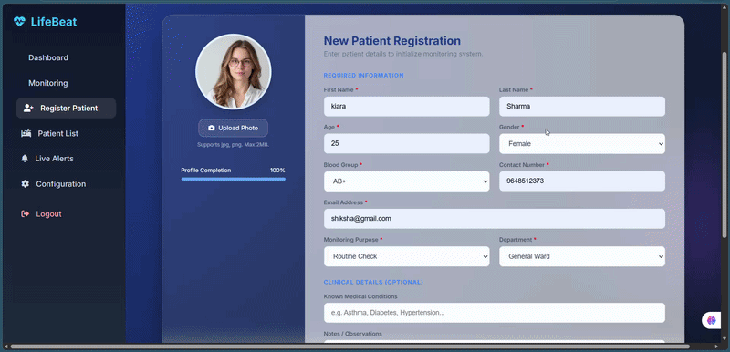

# Patient Monitoring System

A real-time Patient Monitoring System built using Django, SQLite, Python, and Arduino integration.

## Features

* Doctor Authentication System
* Admin Approval Workflow
* 100-Doctor Hospital Database
* Real-time Patient Monitoring
* Heart Rate & SpO2 Monitoring
* Live Alerts System
* Patient Registration Dashboard
* Role-Based Access Control
* Hardware Bridge Integration
* ICU Monitoring Interface

## Project Demo

## Technologies Used

* Python
* Django
* SQLite
* HTML
* CSS
* JavaScript
* Arduino UNO
* MAX30102 Sensor

## Deployment

Hosted on Render.

## Author

Shiksha Trivedi
